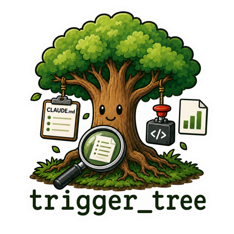
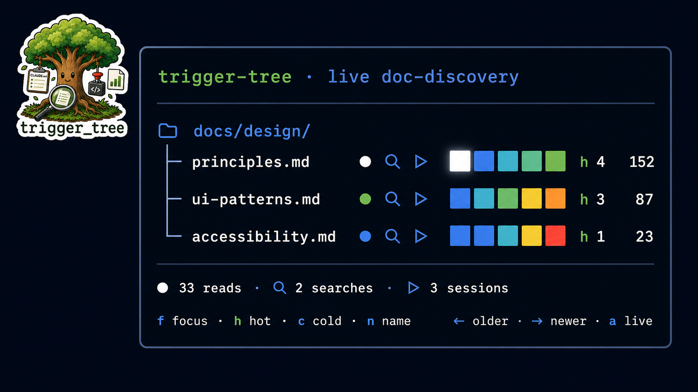

# 🌳 trigger-tree

> **See which project docs your AI actually discovers.**

- Local and dependency-free: no cloud, analytics, or model tokens.
- Separate heat, lifetime reads, searches, and untouched paths instead of guessing intent.
- Reduce the evidence to an A–F documentation health grade when detail is unnecessary.

Documentation steers an AI coding assistant toward your team’s patterns and guardrails. But **a rule that is never read protects nothing**. trigger-tree records discovery evidence so you can improve the routes without pretending a read proves understanding.

## Quick start

| Claude Code | Codex |
|---|---|
| `/plugin marketplace add Hedde/trigger_tree` `/plugin install trigger-tree@trigger-tree` `/reload-plugins` `/tt watch demo` `/tt setup` · `/tt doctor` Work normally, then `/tt insights` | `codex plugin marketplace add Hedde/trigger_tree` `codex plugin install trigger-tree` Restart Codex Ask it to run `python3 "$PLUGIN_ROOT/scripts/tt-watch.py" --demo` Use the bundled trigger-tree skill for setup, doctor, and insights |

The Claude `/tt` skill is explicitly user-triggered. Codex installs the equivalent skill and lifecycle hooks through its plugin marketplace.

## Who gets what?

| You are… | trigger-tree gives you… |
|---|---|
| Senior developer | File/folder heat, search evidence, router gaps, and prompt-level browsing |
| Tech lead | Trends, task clusters, protected-context review, and evidence-backed fixes |
| Product owner | One honest A–F docs-health signal, provisional until measurement matures |

## Commands

| Command | Result |
|---|---|
| `/tt watch demo` | Instant synthetic dashboard; no telemetry required |
| `/tt setup [truncate\|hash\|off]` | Wire the repo and choose prompt privacy |
| `/tt doctor` | Check hooks, liveness, scope, privacy, and statusline wiring |
| `/tt status` | Current heat, lifetime reads, and untouched paths |
| `/tt watch` | Live mock-TUI dashboard with prompt browsing and sorting |
| `/tt insights` | Deterministic analysis plus a local HTML report |
| `/tt suggestions` | Up to five evidence-backed routing improvements |
| `/tt badge` | Write a public-safe docs-health endpoint JSON |
| `/tt note <text>` | Add a local timeline annotation |
| `/tt uninstall` | Remove wiring without deleting telemetry |

Search telemetry is a conservative lower bound; see [measurement boundaries](docs/heat-model.md).

## How it works

1. **Hooks log shell-side** to the gitignored `.trigger-tree/history.jsonl`; failures never interrupt the coding session.
2. **A deterministic aggregator computes every metric** with Python’s standard library; the model interprets but never counts.
3. **Discovery remains model-driven**: trigger-tree measures your routers and reads without injecting context or changing routing.

## Where it fits

| Category | Question answered |
|---|---|
| Token/trace observability (Langfuse, Arize, W&B) | What did the model call, spend, and produce? |
| Documentation linters | Is documentation structurally or stylistically valid? |
| trigger-tree | Which local project docs did the coding assistant actually discover? |

The categories complement each other. trigger-tree does not evaluate answer quality or claim that a read caused an outcome.

## Learn more

[Documentation router](docs/README.md) · [Dashboard](docs/dashboard.md) · [Heat model](docs/heat-model.md) · [Configuration](docs/configuration.md) · [Privacy](docs/privacy.md) · [Glossary](docs/glossary.md) · [FAQ](docs/faq.md) · [Website](https://hedde.github.io/trigger_tree/) · [Changelog](CHANGELOG.md)

MIT © Hedde van der Heide
