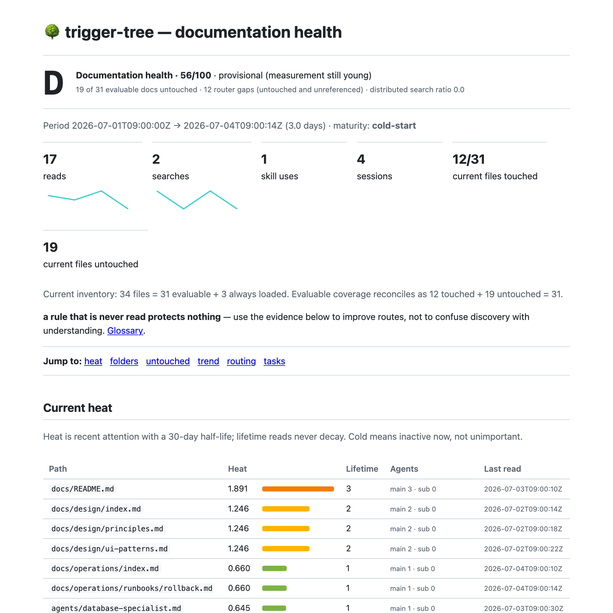

# Dashboard and report

`/tt watch demo` opens the synthetic dashboard immediately. `/tt watch` follows real local history: reads pulse, parent folders ripple, and rows fade to their heat color. The visual always pairs color with five-cell bars, `h` values, and counts.

Controls: `f` recent focus, `h` hottest, `c` coldest, `n` name order, `←`/`→` prompt history, `a` live overview, `s` prompt privacy, `r` refresh, and `q` quit. The live view limits proven activity to ten folders and collapses quiet paths; `/tt insights` retains the complete inventory.

The report keeps heat, lifetime reads, search evidence, routing coverage, trend, task
clusters, protected context, retired paths, and review candidates separate. When a
current directive manifest exists, it adds per-directive opportunities, followed counts,
rate/confidence, unobservable ratio, capture-disabled and awaiting-capture probes, and
always-loaded cost.
`unobserved` is always labeled as missing evidence rather than a violation. A stale
manifest replaces metrics with a refresh instruction instead of silently evaluating old
probes. Its grade is a summary, not a verdict.

Both surfaces also report agent personas when agent capture is on: the report lists
invocations, sessions, last use, and never-invoked definitions; the dashboard shows one
line with the most used persona and the never-invoked count. Neither says anything when
capture is off, because silence would then measure nothing rather than disuse.

The live dashboard includes a compact instruction-adherence panel in demo and measured
modes. The complete evidence (up to five recent session IDs per directive), trend, cost
method, and never-triggered review prompts remain in `/tt insights` and
`/tt instructions`.

Its optional SVG visuals preserve the tables beneath them: single-series KPI sparklines, separate single-axis count and search-ratio trends, and a TUI-shaped indented heat tree. Dashed trend segments mark small samples; neutral note ticks carry tooltip text without implying causation.

This capture comes from the generated, self-contained HTML report. It is separate from the intentionally synthetic dashboard demo on the project homepage.

First run with no evidence explains the loop: work normally and reads light up, or run `/tt watch demo` now.
